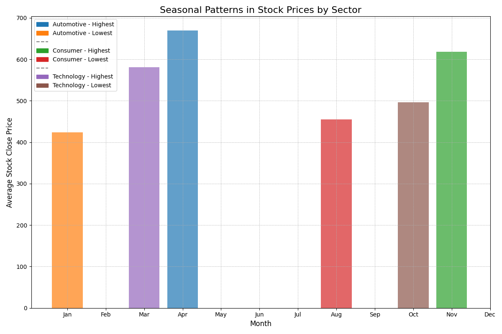
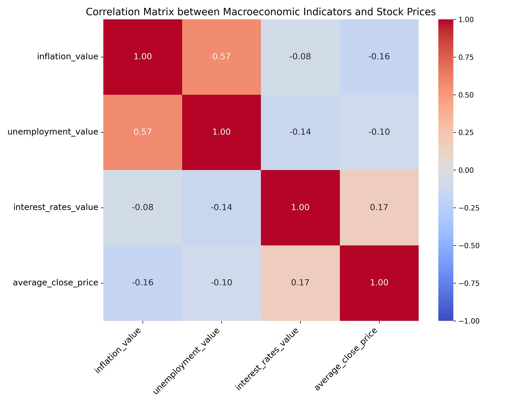
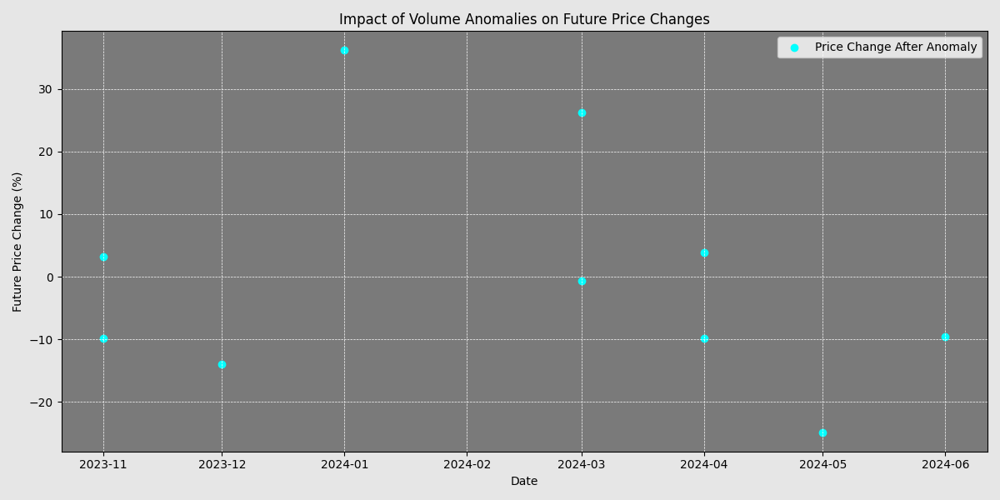
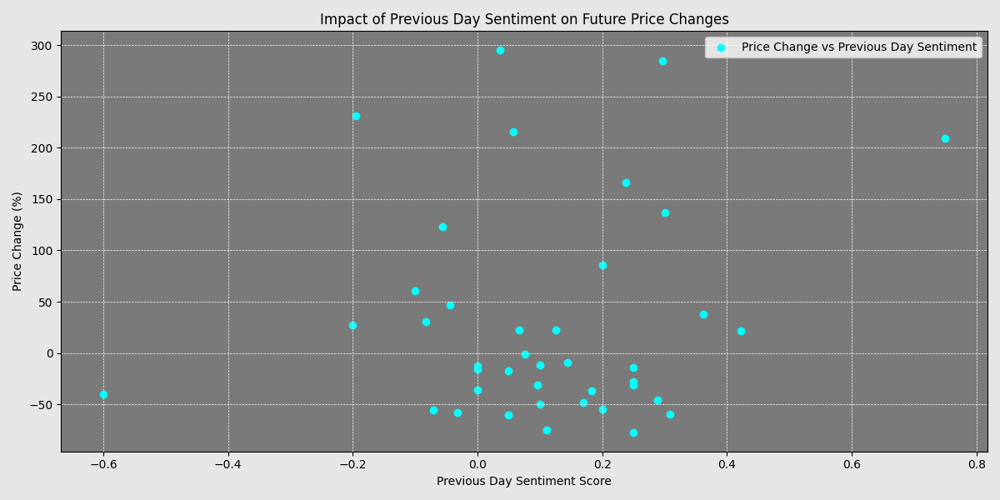
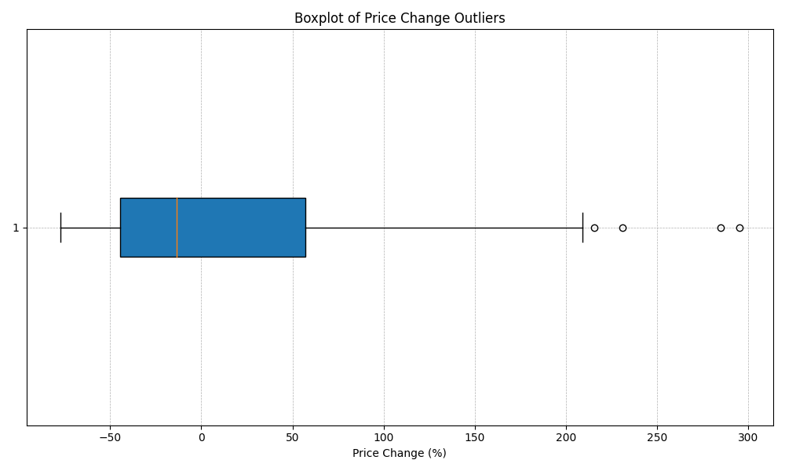

# ETL Project with Macroeconomic and Stock Price Analysis

## Project Description

This project based on PySpark-FAKER Data. (Extract, Transform, Load) system built using Dagster, designed to analyze macroeconomic data and stock prices. The goal is to understand the impact of macroeconomic indicators, trading volume, and news sentiment on stock prices across various sectors.

## Functionalities
This project offers:
- Automated data extraction and transformation using Dagster.
- Macroeconomic and stock price correlation analysis.
- Seasonality detection and visualization.
- Trading volume anomaly detection and analysis.
- News sentiment analysis and its impact on stock prices.
- Real-time monitoring for price changes and anomaly detection.

## Installation
  
1. **Clone the Repository**:
   To get started, clone the repository using the following command:
   ```bash
   git clone https://github.com/ur64n/dagster_etl_analytics
   
2. **Install Dependencies**:
   After cloning the repository, navigate to the project directory and install all necessary dependencies using the following command:
   ```bash
   pip install -r requirements.txt
   ```

   Ensure you have Python and `pip` installed in your environment.

## Usage

Follow these steps to run the project:

1. **Navigate to the Project Directory**:
   Change your directory to the project folder:
   ```bash
   cd /home/urban/Projekty/dagster2/my-dagster-project
   ```

2. **Start Dagster**:
   Launch the Dagster development server to access the ETL pipeline and monitor the jobs:
   ```bash
   dagster dev
   ```

## Project Structure

### Main Modules

1. **db_pipeline**:
   - **extract_all_data**: Extracts data from a PostgreSQL database and saves it to CSV files.
   - **clean_and_structure_data**: Cleans and structures the extracted data for analysis.

2. **seasonity**:
   - **load_and_prepare_seasonity_data**: Loads and prepares data for seasonality analysis.
   - **analyze_seasonality**: Identifies months with the highest and lowest average stock prices for each sector.
   - **visualize_seasonality**: Generates visualizations of seasonal patterns in stock prices.

3. **Correlation**:
   - **process_combined_data**: Merges macroeconomic data with stock data for correlation analysis.
   - **analyze_and_visualize_correlation**: Calculates and visualizes the correlation matrix between macroeconomic indicators and stock prices.

4. **trading volume**:
   - **load_and_filter_volume_data**: Loads and filters stock data for volume analysis.
   - **detect_volume_anomalies**: Detects significant changes in trading volume.
   - **analyze_price_impact_of_anomalies**: Analyzes the impact of volume anomalies on subsequent price changes.
   - **visualize_price_impact**: Visualizes the impact of volume anomalies on future price changes.

5. **sentiment**:
   - **load_and_prepare_sentiment_data**: Prepares news and stock data for sentiment analysis.
   - **analyze_sentiment**: Performs sentiment analysis on news data.
   - **visualize_sentiment_impact**: Visualizes the impact of news sentiment on stock prices.
   - **Price Change Sensor**: Monitors significant changes in stock prices based on sentiment analysis.
   - It is part of the ETL pipeline and is specifically linked to the `tech_sentiment_job`. This sensor continuously checks for anomalies in price changes and triggers further actions if certain conditions are met.
   The **Price Change Sensor** is designed to monitor significant changes in stock prices based on sentiment analysis.

6. **Sensorequest**:
   - **Data Monitoring**: Reads data from a CSV file containing the results of sentiment analysis on stock prices.
   - **Change Detection**: Calculates a hash of the current data to detect any changes since the last evaluation.
   - **Threshold Evaluation**: Checks for any price changes that exceed a predefined threshold (e.g., 10%).
   - **Outlier Handling**: Stores outliers for further analysis.
   - **Visualization Trigger**: Initiates the visualization process to create a boxplot of the detected price change outliers.
   - **Run Request**: Generates a new run request to handle the detected changes if conditions are met.

## Visualisation results of the above pipelines with short descriptions
<p align="center">
**Seasonity**
</p>


The bar chart illustrates the seasonal patterns in average stock close prices across different sectors. Each sector is represented by two bars: one for the month with the highest average close price and another for the month with the lowest. The sectors included are Automotive, Consumer, and Technology, each with distinct color coding for easy differentiation. This visualization helps identify the months where each sector experiences peak and trough stock prices, providing insights into potential seasonal trends.

### Correlation

This heatmap visualizes the correlation between various macroeconomic indicators and average stock closing prices. The matrix includes:

- **Inflation Value**: Shows a moderate positive correlation with unemployment value (0.57) and a slight negative correlation with average close price (-0.16).
- **Unemployment Value**: Displays a moderate positive correlation with inflation value (0.57) and a slight negative correlation with average close price (-0.10).
- **Interest Rates Value**: Exhibits a slight positive correlation with average close price (0.17) and slight negative correlations with both inflation and unemployment values.
- **Average Close Price**: Shows slight correlations with the other indicators, indicating minimal direct impact.

The color gradient from blue to red represents the strength and direction of the correlations, with red indicating a strong positive correlation and blue indicating a strong negative correlation.

### Trading Volume


This scatter plot visualizes the relationship between volume anomalies and subsequent price changes over time. Each point represents a significant change in trading volume and its impact on future stock price changes, measured in percentage. The x-axis shows the date, while the y-axis indicates the percentage change in price following the anomaly. The plot highlights how volume anomalies can lead to both positive and negative price movements in the following months.

### Sentiment


Correlation matrix illustrating the relationships between macroeconomic indicators and stock prices. The matrix uses a color gradient to represent correlation values, ranging from -1 to 1. Key indicators include inflation, unemployment, interest rates, and average stock close prices. The matrix helps identify the strength and direction of relationships between these variables, providing insights into how macroeconomic factors may influence stock market performance.

### Sensor


This boxplot visualizes the distribution of price changes in percentage terms. The central box represents the interquartile range (IQR), with the line inside indicating the median price change. Whiskers extend to show the range of the data, excluding outliers, which are plotted as individual points beyond the whiskers. The plot highlights significant deviations in price changes, providing insights into potential anomalies or extreme values in the dataset.


### Author: ur64n
